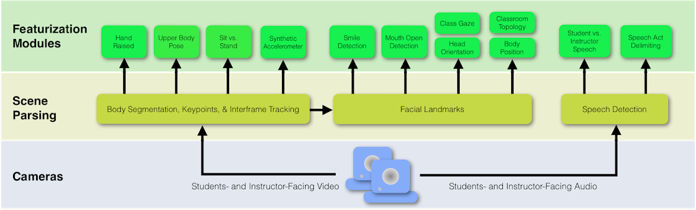
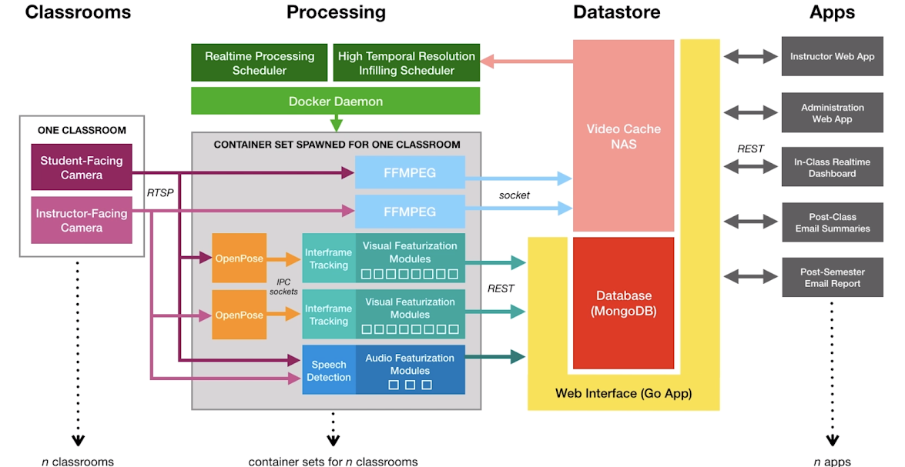
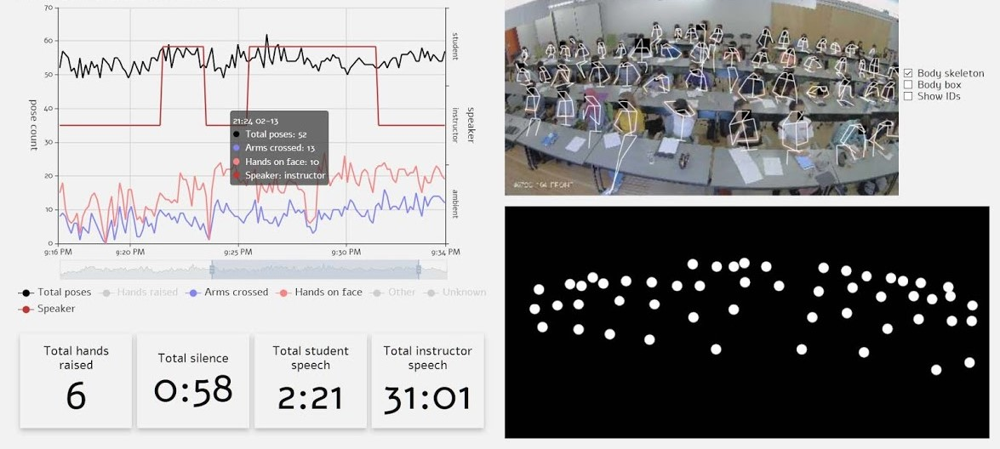

# Real-Time Classroom Sensing System

**Real-Time Classroom Sensing System** represents the first **real-time, in-the-wild evaluated, and practically deployable classroom sensing system at scale**. It is designed to provide **comprehensive analytics of classroom environments** by capturing **multi-modal visual and audio features** that are theoretically linked to **effective teaching and learning outcomes**.

The system integrates computer vision, audio processing, and AI techniques to automatically extract actionable insights about **student engagement, attention, and classroom dynamics**. It is suitable for deployment in real classrooms, supporting both **live monitoring** and **post-class analysis**.

## Features for Students and Instructors

- **Visual Features**:
    - **Body Segmentation, Keypoints and Inter-frame tracking**:
        - Hand Raise Detection
        - Upper Body Pose Estimation
        - Sit vs Stand Detection
        - Synthetic Accelerometer
        - Classroom Topology
    - **Facial Lanndmarks and Attributes**:
        - Smile Detection
        - Mouth State Detection
        - Gaze Estimation
- **Audio Features**:
    - **Speech Detection**:        
        - Student vs Instructor Speech
        - Speech Act Delimation   

### System Architecture


### Visualization Dashboard



## Installation

> **Requirements:** Python 3.9+, OpenCV, MediaPipe, Dlib, TensorFlow/PyTorch, Flask/FastAPI for backend

1. Clone the repository:

```bash
git clone https://github.com/arafathosense/Real-Time-Classroom-Sensing-System.git
cd Real-Time-Classroom-Sensing-System
```

2. Create a virtual environment and activate it:

```bash
python -m venv venv
source venv/bin/activate  # Linux/macOS
venv\Scripts\activate     # Windows
```

3. Install dependencies:

```bash
pip install -r requirements.txt
```

4. Run the dashboard frontend:

```bash
# If React
cd frontend
npm install
npm start
```

## System Architecture

**The system is modular and includes:**

1. **Capture Module**

   * Multi-camera real-time video feed
   * Audio stream capture

2. **Processing Module**

   * Face detection & tracking (MediaPipe / Dlib)
   * Eye gaze estimation (OpenFace / MediaPipe Iris)
   * Pose detection (OpenPose)
   * Facial expression & emotion recognition (CNN models)
   * Audio feature extraction (volume, speech activity)

3. **Analytics Module**

   * Aggregates visual/audio features
   * Computes per-student engagement scores
   * Provides attention heatmaps

4. **Dashboard Module**

   * Visualizes live student engagement
   * Displays teacher performance analytics
   * Stores session data for research

## Data Collection and Outputs

The system outputs:

* **Per-student attention score (0–100)**
* **Engagement heatmaps**
* **Facial emotion logs (happy, neutral, confused, bored, etc.)**
* **Audio activity metrics**
* **Session CSV or JSON logs** for research


## Research and Practical Impact

This system allows educators and researchers to:

* Understand student engagement in **large-scale classrooms**
* Identify which teaching methods maximize attention
* Generate **empirical data** for improving learning outcomes
* Deploy real-time monitoring tools for **online and hybrid education**


## Contributing

We welcome contributions! You can:

* Add new features (e.g., AI models for engagement)
* Improve the dashboard visualization
* Optimize real-time performance
* Submit pull requests or report issues

## 👤 Author

**HOSEN ARAFAT**  

**Bachelor of Software Engineering, China**  

**GitHub:** https://github.com/arafathosense

**Research Interest: Image Computing and Perceptual Intelligence**
